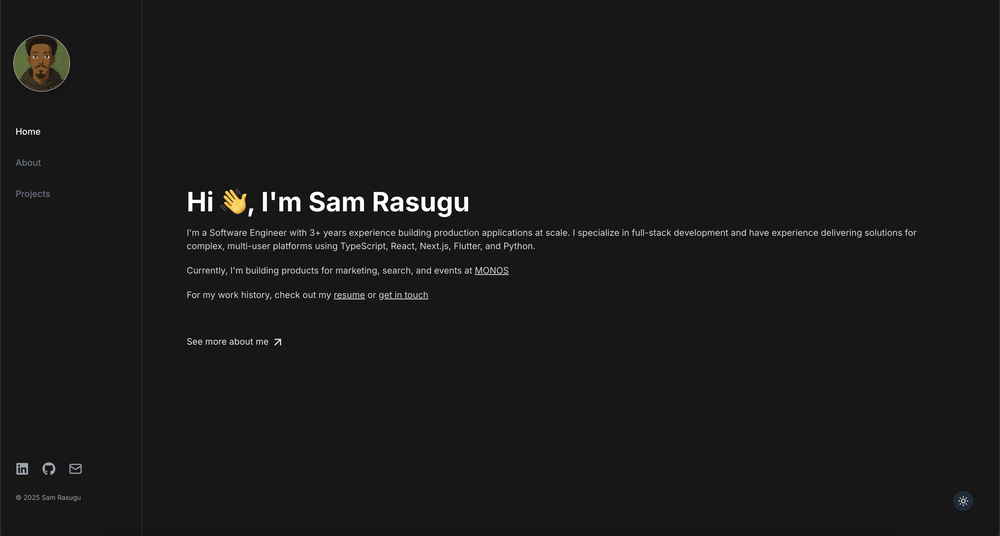

# 🧑🏾‍💻 Sam Rasugu – Portfolio Website

Welcome to the source code for [samrasugu.com](https://samrasugu.com), my personal portfolio site. Built with modern web technologies, this site showcases my work, skills, and experience as a software engineer.



## 🚀 Tech Stack

- **Next.js** – React framework for production-grade apps
- **TypeScript** – Static typing for improved code quality
- **Tailwind CSS** – Utility-first CSS framework for rapid UI development
- **Sanity.io** – Headless CMS for managing content

## 🎯 Features

- 📄 Dynamic pages (Projects, Experience, Contact) powered by Sanity
- 🌙 Responsive design with a clean, modern UI
- ⚡ Optimized performance and SEO
- 🧠 Fully typed and maintainable codebase

## 📁 Project Structure

```bash
.
├── app/                 # Next.js app directory
├── components/          # Reusable React components
├── lib/                 # Utility functions and CMS setup
├── studio-cms/          # Sanity schema and config
├── public/              # Static assets
├── styles/              # Global styles and Tailwind config
├── tsconfig.json        # TypeScript configuration
└── ...
```

## 🛠️ Setup & Development

### 1. Clone the repo
```git clone https://github.com/samrasugu/sam-rasugu.git```
```cd portfolio```

### 2. Install dependencies
```npm install```

### 3. Set up environment variables
```cp .env.example .env.local```
<p>Fill in the required values in `.env.local`<p>

### 4. Run the development server
```npm run dev```


## 🧩 Sanity Studio
### Navigate to the Sanity folder
```cd studio-cms```

### Install dependencies
```npm install```

### Start the Sanity Studio
```npm run dev```

Make sure you have a Sanity project set up. Learn more at [Sanity.io](www.sanity.io).


## 🧪 Linting & Formatting
### Lint the project
```npm run lint```

### Format code using Prettier
```npm run format```

